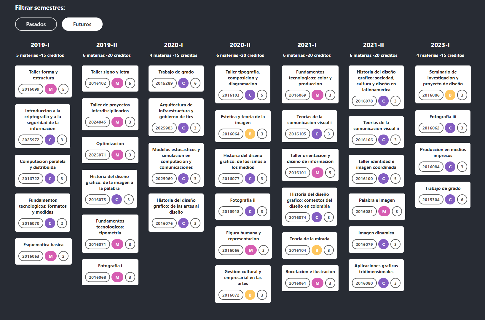

# mallas-maker-alpha
Mallas maker es una app web que permite a los estudiantes de la Universidad Nacional de Colombia, hacer sus propias mallas curriculares para planear su carrera, la fecha de graduación y el orden de las materias que quieren ver. Este es un proyecto abierto a la comunidad universitaria, y hace parte de una serie de aplicaciones pensadas para facilitar los procesos de planeación académica de todo tipo de estudiante universitario.

Desarrollada con Firebase + React.js. Esta aplicación utiliza la intuitiva librería [react-beautiful-dnd](https://www.npmjs.com/package/react-beautiful-dnd) para soportar las interacciones drag and drop de las materias de la malla curricular.

Este es un proyecto en progreso, para más información, escribir a yatorresm@unal.edu.co

Y aquí un avance de cómo se ve una malla curricular de un estudiante con doble titulación en Diseño gráfico e Ingeniería de Sistemas y Computación.

